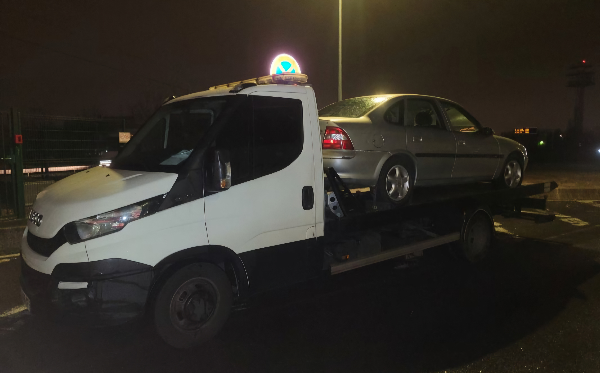

## Épaviste à Colomiers (31770)

- Intervention **1–2 h** à Colomiers et secteur Ouest toulousain.
- **Certificat de destruction** fourni + **déclaration** effectuée.
- **Zéro frais cachés** : devis annoncé avant enlèvement.

> Besoin d’un **enlèvement d’épave à Colomiers** ? Remorquage sécurisé vers un **centre VHU agréé 31** et prise en charge administrative complète.

---

## Démarches : comment ça se passe à Colomiers ?

1. **Contact** au 📞 **+33 7 75 72 60 36** ou via le formulaire.
2. **Vérification des pièces** (carte grise, CNI, Cerfa).
3. **Planification** : passage en **1–2 h** selon votre quartier (Val d’Aran, En Jacca, Les Ramassiers…).
4. **Remorquage** vers un VHU agréé de Haute-Garonne.
5. **Remise du certificat de destruction** + **déclaration**.

> Véhicules pris en charge : **épave non roulante**, **accidentée**, **VHU**, utilitaire, 2-roues.

---

## Zones couvertes autour de Colomiers

- **Colomiers** intra-muros : Centre, Cabirol, Ramassiers, En Jacca, Bascule-Oratoire.
- Communes voisines : **Tournefeuille, Pibrac, Blagnac, Cornebarrieu, Aussonne, Léguevin**…
- Intervention possible jusqu’à **100 km** autour de Toulouse.

---

## Gratuité & conformité

- **Gratuit** si véhicule **complet** et **accessible**.
- **Rapide** : délai moyen **1–2 h**.
- **Conforme** : dépollution et recyclage en **centre VHU agréé**.

---

## Documents nécessaires

- **Carte grise** (ou justificatif).
- **Pièce d’identité**.
- **Clés** si disponibles.
- **Formulaire Cerfa** (on vous accompagne).

---

## FAQ Colomiers

**L’enlèvement est-il gratuit à Colomiers ?**  
Oui si le véhicule est **complet** et accessible. Sinon, un **forfait** peut s’appliquer (annoncé avant).

**Délais d’intervention ?**  
En moyenne **1 à 2 heures** suivant votre secteur et la circulation.

**Que devient l’épave ?**  
Acheminée vers un **VHU agréé** pour **dépollution** et **recyclage**.

---

## Illustrations

---

## Appel à l’action

- 📞 **Appeler maintenant** : +33 7 75 72 60 36
- ✉️ **Demander un devis** : [/contact](/contact)

---

## Voir aussi

- ▶️ **Service : [Enlèvement d’épave à Toulouse](/services/enlevement-epave-toulouse)**
- 📍 **Zone : [Épaviste gratuit en Haute-Garonne](/zones/haute-garonne)**
- ✅ **Procédure : [Certificat de destruction – mode d’emploi](/guides/certificat-destruction)**
