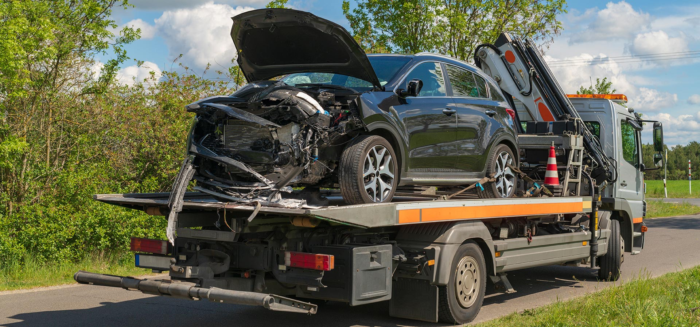
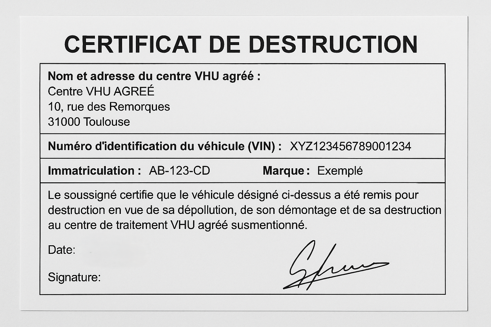
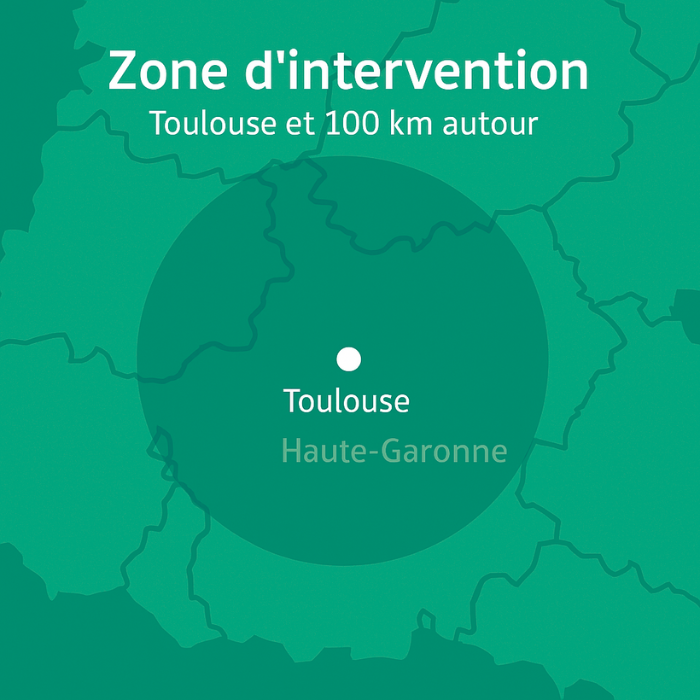

## À retenir

- Intervention **1–2 h** à Toulouse et **100 km** autour.
- Certificat de destruction **fourni et géré**.
- **Zéro frais cachés**. Devis clair avant enlèvement.

> Besoin d’un **épaviste à Toulouse** rapidement ? Nous réalisons l’**enlèvement d’épave gratuit** avec remorquage sécurisé et prise en charge administrative complète.

---

## Démarches : comment se passe l’enlèvement de voiture à Toulouse ?

1. **Prise de contact** au 📞 **+33 7 75 72 60 36** ou via le formulaire.
2. **Vérification des pièces** (carte grise, pièce d’identité, formulaire Cerfa).
3. **Planification** d’un créneau : intervention en **1–2 h** selon le secteur.
4. **Remorquage** vers un centre VHU agréé (Haute-Garonne).
5. **Remise du certificat de destruction** et **déclaration** auprès des services compétents.

> Nous intervenons sur toutes situations : **véhicule hors d’usage**, **voiture accidentée**, **voiture épave non roulante**, utilitaire, 2-roues.

---

## Zones couvertes autour de Toulouse

- Toulouse intra-muros (tous quartiers) et **Haute-Garonne (31)** : Colomiers, Blagnac, Tournefeuille, Labège, Balma, Muret, etc.
- Dépannage possible jusqu’à **100 km** : Montauban, Castres, Albi, Auch…

---

## Pourquoi choisir un épaviste gratuit en Haute-Garonne ?

- **Gratuit** si les conditions techniques sont réunies (accessibilité, véhicule complet).
- **Rapide** : intervention **1–2 h** pour l’**enlèvement de véhicule à Toulouse**.
- **Conforme** : destruction dans un **centre VHU agréé** avec traçabilité.

---

## Documents nécessaires

- **Carte grise** ou justificatif.
- **Pièce d’identité** du titulaire.
- **Clés** si possible.
- **Formulaire Cerfa** (nous vous guidons).

---

## Questions fréquentes (FAQ)

**L’enlèvement est-il vraiment gratuit ?**  
Oui, l’**enlèvement d’épave gratuit à Toulouse** est possible lorsque le véhicule est **complet** et accessible. Sinon, un **petit forfait** peut s’appliquer (annoncé avant intervention).

**Combien de temps pour l’intervention ?**  
En moyenne **1 à 2 heures** selon l’adresse et la circulation.

**Que devient mon véhicule ?**  
Il est acheminé vers un **VHU agréé** pour **dépollution** et **recyclage** conformément à la réglementation.

---

## Illustrations

---

## Appel à l’action

- 📞 **Appeler maintenant** : +33 7 75 72 60 36
- ✉️ **Demander un devis gratuit** : [/contact](/contact)

---

## Voir aussi

- ▶️ **Service : [Enlèvement d’épave à Toulouse](/services/enlevement-epave-toulouse)**
- 📍 **Zone : [Épaviste gratuit en Haute-Garonne](/zones/haute-garonne)**
- ✅ **Procédure : [Certificat de destruction – mode d’emploi](/guides/certificat-destruction)**
- 🚚 **Délais : [Intervention 1–2 h – comment ça marche ?](/guides/delais-intervention)**
